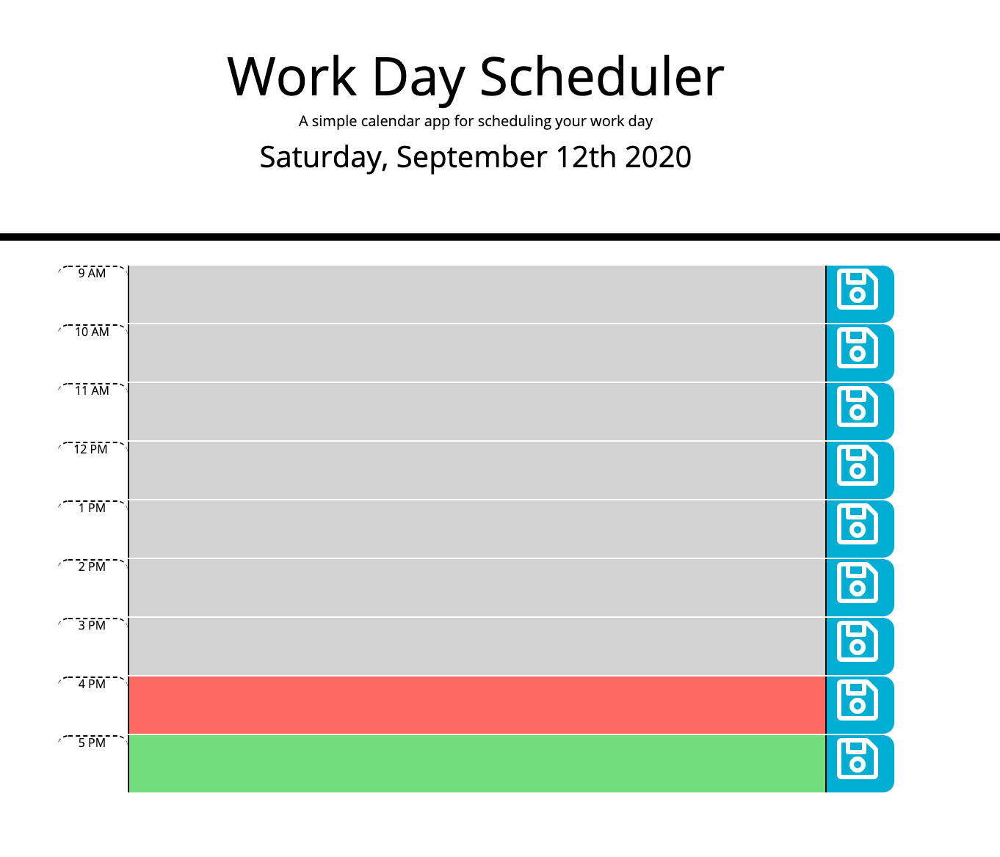

# Day-Planner

Welcome to my Day Planner! By utilizing jQuery and Moment.js, I've built an interactive day planner that displays the current day, as well as a list of todo's that persist when the page is refreshed. 

## HTML 
I utilized my HTML to hard code the rows and columns necessary for my day planner. I added the text element tag in for the description boxes so that text could be added. I also assigned id's and classes so that they could be targeted by jQuery. The button styling was also affected in the HTML by adding in a font awesome class for my save buttons! 

## Moment.js
Moment provided the current time functionality for this application. Moment is used in the header to display the current day to the screen. Moment was also used to determine the current time so that it could be compared to the time displayed on the planner. 

## jQuery
I used jQuery targeting techniques to target elements from the HTML on my javascript. I used jQuery selectors to target items such as class, id, and headings. I used if/else statements to compare the current time and the top displayed on the planner and assigned the correct class of past, future, or present, based on that comparison. Finally, I added event listeners for my save buttons so that when the save button was clicked, it saved the description box's content to local storage. That way, it persists when the page is refreshed! 

## Final Thoughts
This assignment was challenging, but we had all of the tools to complete it. I personally chose to hard-code because the application is made of one static page that does not change other than the text area, but I also understand how important dynamically generating content is. I plan to work back through this assignment with all dynamically generated content in the future! 

## Links 
link to github repository: https://github.com/jadavianett/Day-Planner 
link to deployed application: https://jadavianett.github.io/Day-Planner/

